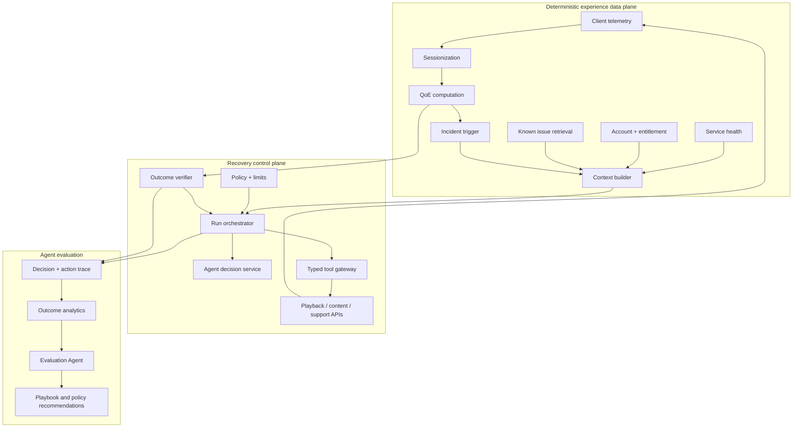
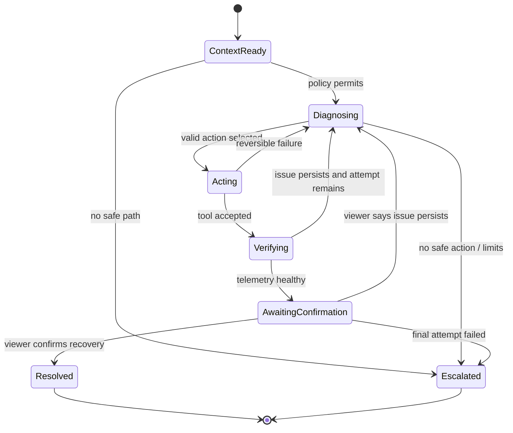

# Playback Recovery Agent

A product concept for closed-loop digital experience optimization: detect a
playback problem, diagnose it from session evidence, take bounded corrective
action, and verify the customer outcome from telemetry.

This prototype explores a simple product question:

> What if digital experience analytics could resolve an issue—not only report
> it?

## Why this exists

Playback support is usually reactive. A customer reports an issue after the
moment has passed, support asks for details the customer cannot reproduce, and
operations teams manually correlate fragmented evidence.

The Recovery Agent moves resolution into the live session:

1. Observe the customer experience continuously.
2. Prepare trustworthy context with deterministic data processing.
3. Let an agent diagnose ambiguity and choose a bounded action.
4. Execute typed, reversible tools behind policy gates.
5. Verify recovery from telemetry, then ask the viewer to confirm.
6. If the issue persists, use that feedback as evidence and choose a different
   safe repair path.
7. Learn which action sequences produce the best outcomes.

## Demo

The player includes buffering, stopped playback, green screen, subtitle,
audio-sync, picture-quality, and content-loading scenarios. Each issue maps to
an allowlist of typed actions such as reloading subtitles, resetting the video
decoder, refreshing authorization, or reloading content at the saved position.

```bash
npm install
npm run dev
```

Open [http://localhost:3000](http://localhost:3000). The application has three
views:

- **Player Demo:** play the demo video, report an issue, follow the
  conversation, and confirm the outcome.
- **Operations:** inspect the same live run trace and aggregate
  Evaluation Agent analysis.
- **Agent Framework:** review the problem, six-layer design, model levels, and
  autonomy boundaries.

The views share the current browser session directly, so the deployed demo does
not require a database or local filesystem.

### Optional real Agent API

The repository runs without credentials. By default,
`POST /api/agent/decide` returns a validated fallback playbook.

To enable a real OpenAI-compatible model:

1. For an interview demo, enter a disposable OpenAI API key in the page header
   and select **Apply**. The key stays in React memory for the current page
   session and is not persisted by the application.
2. For a safer hosted configuration, set the key server-side:

```bash
cp .env.example .env.local
# Add AGENT_API_KEY and optionally change AGENT_API_URL / AGENT_MODEL
npm run dev
```

The key remains on the Next.js server and is never sent to the player. A live
model can only choose two different actions from the issue-specific allowlist.
Its JSON response is schema-validated. A missing key, timeout, provider error,
unknown action, or invalid response automatically falls back to the built-in
playbook. The dashboard labels every decision as **LIVE API** or
**FALLBACK PLAYBOOK**.

GitHub Pages cannot run the server proxy needed by this flow. Deploy the
repository to a Next.js server runtime such as Vercel. The page input is a
demo-only convenience: browser developer tools and hosting infrastructure can
observe requests, so use a temporary, restricted key and revoke it afterward.

### Evaluation Agent

The dashboard includes a second, offline-style agent that analyzes aggregate
outcomes by playback issue. It compares verified agent resolution with the
rules-only baseline and recommends one of three operating modes:

- **Use agent:** adaptive diagnosis produces material success-rate lift.
- **Hybrid:** run deterministic rules first, then agent for unresolved cases.
- **Rules first:** measured lift does not yet justify model cost.

The demo uses a clearly labeled synthetic 30-day cohort. With an API key,
`POST /api/agent/evaluate` produces a schema-validated analysis; otherwise it
uses the same lift thresholds deterministically. Results are cached so opening
the dashboard does not repeatedly incur model cost. Production evaluation
should run as a scheduled batch over governed outcome data, not on every page
view.

## Product principles

- **Outcome over activity:** success requires healthy playback evidence and
  customer confirmation—not merely a tool returning `200`.
- **AI only where judgment helps:** aggregation, policy, budgets, and
  verification remain deterministic.
- **Bounded autonomy:** every run has action permissions, time, tool-call, and
  dollar limits.
- **Evidence before explanation:** diagnosis is grounded in session and service
  signals.
- **Instrument the agent itself:** decisions, actions, cost, latency, and
  outcomes become optimization data.

## What is precomputed vs. agentic?

| Deterministic / precomputed | Agent responsibility |
| --- | --- |
| Sessionization and QoE metrics | Reconcile ambiguous or conflicting evidence |
| Error taxonomy and incident trigger | Form and rank diagnostic hypotheses |
| Service-health and account joins | Select the next allowed action |
| Similar-incident retrieval | Adapt when an action does not work |
| Consent, permissions, and risk policy | Produce a grounded customer explanation |
| Tool schema and parameter validation | Write a structured escalation summary |
| Budget, timeout, and retry enforcement | — |
| Outcome verification and audit log | — |

The LLM never decides whether it is authorized to act, never calculates its own
budget, and never declares its own success.

## Cost controls

The dashboard intentionally does not claim a live dollar budget. Without
provider usage and pricing data, such a number would be mock data. A production
implementation would apply controls in this order:

1. Trigger only on a qualified incident, not every telemetry event.
2. Build a compact structured context before calling a model.
3. Resolve known patterns with deterministic playbooks.
4. Route simple cases to a small model; escalate model capability only when
   uncertainty justifies it.
5. Cache stable context and retrieved playbooks.
6. Enforce hard limits: 2 model calls, 6 tool calls, 60 seconds, and a
   tenant-configured provider budget.
7. Stop immediately after telemetry and the viewer confirm recovery.

If the viewer says the problem remains, the run may use its second and final
model call to reassess the evidence and select a different action sequence. It
never repeats the same failed repair. A second negative confirmation ends
autonomy and creates a complete human handoff.

Track **cost per verified resolution**, not cost per model call:

```text
cost_per_resolution =
  (model_tokens + tool_compute + telemetry_queries) / verified_resolutions
```

All values shown in the UI are illustrative synthetic data, not production
benchmarks or vendor pricing.

## Product strategy

### Product thesis

Digital experience platforms are excellent at explaining what went wrong. The
next step is to safely change the outcome while the customer is still in the
experience.

Playback Recovery turns session telemetry into bounded action and verified
customer recovery. The broader opportunity is not a single support bot; it is
an intelligence and optimization layer for agent-operated digital experiences.

### Customer problems

- **Viewer:** fix the stream now without making me diagnose the product.
- **Support:** provide live evidence and attempted actions so the customer does
  not need to reproduce or repeat the issue.
- **Operations:** automate known recovery paths without uncontrolled production
  risk.
- **Product leader:** show whether agents achieve outcomes, what drives success,
  and how to improve them.

### Product bet

If a platform combines full-session experience telemetry with governed action,
it can resolve a meaningful subset of playback incidents faster than reactive
ticket workflows.

```text
Experience signal → Agent decision → Product action → Verified outcome → Optimization
```

Without objective outcome telemetry and viewer confirmation, an agent only
knows that it completed an action—not whether it helped the customer.

### Initial wedge

Start with frequent, low-risk, reversible playback incidents:

- expired authorization or signed content URL;
- buffering and unstable delivery routes;
- stale player or content state;
- recoverable DRM or decoder failures;
- green screen or incompatible video format;
- missing, inaccurate, or delayed subtitles;
- audio synchronization problems;
- poor adaptive quality selection.

Exclude billing, account security, destructive actions, entitlement mutation,
and broad service changes from autonomous scope.

### User journey

1. A viewer reports a problem from the player.
2. Session context is assembled automatically; the viewer does not reproduce it.
3. The assistant explains what it can safely check and requests consent.
4. The agent diagnoses the evidence and selects allowed recovery actions.
5. Typed tools execute with visible conversational progress.
6. Telemetry verifies technical recovery.
7. The viewer confirms whether the original problem is resolved.
8. A negative answer becomes evidence for one alternative AI-guided repair.
9. A second failure ends autonomy and produces a complete human handoff.

### Success metrics

**North star:** verified autonomous resolution rate.

A resolution counts only when telemetry is healthy, the viewer confirms the
symptom is gone, and no human intervention occurred.

Supporting metrics:

- median time to verified recovery;
- escalation and false-resolution rates;
- repeat issue or abandonment after intervention;
- action success by issue, device, app version, and sequence;
- cost per verified resolution;
- policy violation and rollback rate.

### MVP scope

Included:

- seven playback issue scenarios with realistic session context;
- a functional player with a bundled CC0 demo video and custom controls;
- customer-facing conversational recovery;
- optional real Agent API with validated fallback;
- typed, allowlisted actions;
- telemetry and viewer outcome verification;
- one bounded AI replan after negative feedback;
- live local run trace and Evaluation Agent dashboard;
- human escalation after the final attempt.

Intentionally simulated:

- playback telemetry and service health;
- tool execution and API responses;
- historical outcome cohort;
- production policy and identity systems.

Simulation keeps the interview demo deterministic. The hypothesis being tested
is the workflow, trust model, and product surface—not an unvalidated production
integration.

### Roadmap

**Phase 1 — Prove the loop**

- replay de-identified historical incidents;
- validate the issue taxonomy and safe-action coverage;
- establish outcome labels and false-resolution review.

**Phase 2 — Narrow autonomy**

- run recommendations in shadow mode;
- launch Tier 0 observation and selected Tier 1 actions;
- add tenant policy, customer consent, holdouts, and kill switches;
- compare agent-guided recovery with rules-only and support workflows.

**Phase 3 — Optimize behavior**

- rank action sequences by cohort and verified outcome;
- test model, prompt, and playbook versions;
- recommend policy changes with human approval.

**Phase 4 — Platform**

- extend the observe/decide/act/verify loop beyond playback;
- provide reusable agent analytics, evaluation, and governance;
- support customer-built agents and external tool ecosystems.

### Key product risks

- **Customer trust:** an unwanted restart can be worse than the issue. Require
  consent, preserve state, prefer low-disruption actions, and support rollback.
- **False resolution:** an API success is not customer recovery. Require
  telemetry verification and viewer confirmation.
- **Automation blast radius:** a bad decision can scale quickly. Use typed
  tools, narrow action tiers, cohort rollout, circuit breakers, and kill
  switches.
- **Cost without outcome:** model use may increase without improving recovery.
  Use rules-first routing, hard call limits, caching, and cost per verified
  resolution.
- **Privacy:** session context may contain sensitive identifiers. Apply
  purpose-limited fields, tokenization, retention controls, and audit access.

## System architecture

### Design goals

The system must:

- act while the affected playback session still exists;
- distinguish device, content, network, account, and service causes;
- use the least disruptive action likely to work;
- remain within consent, permission, risk, call-count, and time boundaries;
- verify outcomes independently of the model;
- produce a complete trace for support, evaluation, and audit.

### High-level architecture



The data plane handles continuous, high-volume computation. The recovery
control plane starts only for qualified incidents, keeping model inference out
of the telemetry hot path.

### Session and QoE pipeline

Continuously computes startup time, rebuffering, error rate, bitrate stability,
video progress, and abandonment. This is stream processing—not an LLM task.

### Incident trigger

Combines thresholds, state transitions, and known patterns. It suppresses
duplicates and opens a run only while the customer is reachable and an
actionable issue exists.

### Context builder

Produces a compact, versioned object rather than sending raw events:

```json
{
  "incident": {"type": "playback_stopped", "started_at": "..."},
  "session": {"device": "TV streaming device", "position_sec": 1122},
  "qoe": {"fatal_errors": 3, "rebuffer_ratio": 0.142},
  "service_health": {"origin": "healthy", "cdn": "healthy"},
  "allowed_actions": ["refresh_playback_session", "reload_content"],
  "run_limits": {"model_calls": 2, "tool_calls": 6, "deadline_sec": 60}
}
```

PII is removed or tokenized here. Raw identifiers and unnecessary telemetry do
not enter the prompt.

### Policy engine

The policy engine evaluates consent, tenant configuration, data sensitivity,
risk, and environment. The model cannot override it.

- **Tier 0 — observe:** query health and session state.
- **Tier 1 — reversible session action:** reload subtitles, refresh a manifest,
  reset a decoder, or restart the local player with prior consent.
- **Tier 2 — account-impacting action:** change entitlement or sign out devices;
  explicit confirmation required.
- **Tier 3 — destructive or broad action:** billing, deletion, or multi-user
  service changes; human only.

### Recovery orchestrator

The orchestrator owns state, idempotency, deadlines, retries, and the run trace.
The model is a stateless decision dependency.



### Agent decision service

`POST /api/agent/decide` receives structured context and issue-specific allowed
actions. With `AGENT_API_KEY`, it calls an OpenAI-compatible chat-completions
API. The response must contain:

```json
{
  "diagnosis": "expired_playback_authorization",
  "actionIds": ["refresh_playback_session", "reload_content"]
}
```

The server validates the schema and requires exactly two distinct allowlisted
actions. On a missing key, timeout, provider error, invalid schema, repeated
action, or unknown action, it returns the versioned fallback playbook.

Environment-configured credentials remain server-side. A key entered in the
demo header is held only in page memory and sent to the same-origin API route;
the player never calls the model provider directly. The trace stores concise
evidence and decision summaries—not hidden chain-of-thought.

### Typed tool gateway

The gateway validates schemas, rechecks policy, injects credentials, applies
timeouts, uses idempotency keys, and redacts responses. The model cannot make
arbitrary HTTP requests.

Example action allowlist:

- reload or resynchronize subtitles;
- refresh playback authorization;
- reload content at the saved position;
- reset the video decoder or switch codec;
- switch delivery route or stabilize bitrate;
- renew a media license or rebuild the playback pipeline;
- clear a stale content manifest and request a signed URL.

### Outcome verifier

A successful tool response is not proof of recovery. Technical recovery
requires sustained product evidence such as:

- video position advances;
- no new fatal playback error;
- rebuffering remains below threshold;
- player state is `PLAYING`.

The viewer then confirms whether the original symptom is gone. A verified
resolution requires both healthy telemetry and explicit confirmation.

If the viewer reports that the issue persists, that answer becomes new
evidence. The second model call must select a different allowed sequence. A
second negative answer triggers human handoff with the full evidence, decision,
action, and confirmation trace.

### What uses AI?

| Step | Default owner | Reason |
| --- | --- | --- |
| Compute QoE and detect state changes | Data pipeline | Exact, high-volume |
| Join session, service, and account context | Context builder | Repeatable and cacheable |
| Check consent and allowed actions | Policy engine | Security boundary |
| Diagnose conflicting evidence | Agent | Contextual judgment |
| Choose among safe actions | Agent | Adaptive planning |
| Validate and execute an action | Tool gateway | Typed and auditable |
| Check technical recovery | Outcome verifier | Objective product state |
| Confirm perceived recovery | Viewer | Captures issues telemetry cannot prove |
| Replan after negative confirmation | Agent | New evidence requires judgment |
| Explain the result | Template first, agent for nuance | Cost/quality tradeoff |

## Reliability and safety

- **Idempotency:** each mutation uses `run_id + action_index`.
- **Compensation:** reversible tools define a rollback operation.
- **Circuit breaker:** disable actions when regression exceeds a threshold.
- **Concurrency:** permit one active recovery run per playback session.
- **Rate limiting:** enforce tenant, user, action, and downstream limits.
- **Prompt injection defense:** customer text is untrusted evidence, never
  executable instructions.
- **Human handoff:** include evidence, attempts, results, and the recommended
  next step so the customer does not repeat the story.
- **Auditability:** trace prompt, model, policy, and tool versions.

## Cost architecture

The mock does not display a dollar budget because it has no provider usage or
pricing data.

Production controls:

- maximum 2 model calls;
- maximum 6 tool calls;
- maximum 60 seconds;
- stop immediately after verified recovery;
- route known patterns to deterministic playbooks;
- use a small model before considering a larger model;
- cache stable context and scheduled Evaluation Agent results;
- apply a tenant-configured provider spend cap.

Record input, output, and cached tokens; provider model cost; telemetry query
cost; tool compute cost; and verified outcome. Optimize:

```text
cost_per_verified_resolution =
  sum(total_cost) / count(verified autonomous resolutions)
```

## Agent observability

Instrument:

- run start, decision, tool call, verification, and confirmation;
- diagnosis band, evidence references, model, prompt, and playbook version;
- tool latency, normalized error, retry, and rollback;
- time to recovery, escalation reason, and post-action abandonment;
- provider usage, cost, deadline consumption, and policy denial;
- decision source: live API, server fallback, or local fallback.

This answers:

- Are agents achieving customer outcomes?
- Which cases benefit from an agent rather than rules?
- Which evidence and action sequences drive success?
- Where do context, policy, model, or tool failures occur?

## Evaluation strategy

### Offline

Replay de-identified historical incidents with known outcomes. Measure
diagnosis quality, evidence grounding, action selection, policy compliance,
verified recovery, and cost.

### Shadow

Run decisions against live context without executing tools. Compare
recommendations with actual support outcomes.

### Controlled rollout

Start with Tier 0 and a narrow Tier 1 cohort. Use tenant allowlists, holdouts,
action kill switches, and automatic rollback.

### Online

Use verified autonomous resolution as the primary metric. Guardrails include
false resolution, repeat issue, abandonment, policy violation, tool regression,
and opt-out.

### Evaluation Agent

`POST /api/agent/evaluate` compares aggregate agent outcomes against a
rules-only baseline by issue class. It recommends:

- **Use agent** when adaptive recovery produces material lift;
- **Hybrid** when rules should run first and the agent handles unresolved cases;
- **Rules first** when measured lift does not justify model cost.

The demo cohort is explicitly synthetic. With an API key, the endpoint returns
a schema-validated model analysis. Without one, it applies deterministic lift
thresholds. Results are cached; production evaluation should run as a scheduled
batch rather than on every page view.

## Prototype vs. production

| Area | This repository | Production direction |
| --- | --- | --- |
| Telemetry | Static scenarios | Streaming QoE platform |
| Orchestration | Shared browser session | Durable workflow engine |
| Model | Optional API + fallback playbook | Model gateway with routing |
| Tools | Simulated typed results | Authenticated service adapters |
| Policy | Visible fixed limits | Tenant policy service |
| Verification | Simulated telemetry + viewer | Real-time telemetry query |
| Analytics | In-memory trace + synthetic cohort | Agent trace warehouse |

## Repository guide

```text
src/app/page.tsx                        Playback issue dashboard
src/app/DemoPlayer.tsx                  Customer-facing player experience
src/app/api/agent/decide/route.ts       Recovery decision API
src/app/api/agent/evaluate/route.ts     Aggregate Evaluation Agent
src/app/globals.css                     Responsive visual system
.env.example                            Optional Agent API configuration
```

## Scope and integrity

This is a high-fidelity product prototype. Telemetry, tool responses, and
historical metrics are mock data so the demo is reliable and requires no
customer information. The interface labels simulated data explicitly. The
All names, sessions, telemetry, and outcome data in this repository are
fictional.

## License

[MIT](LICENSE)

The bundled flower video is the CC0 sample published by MDN Web Docs.
